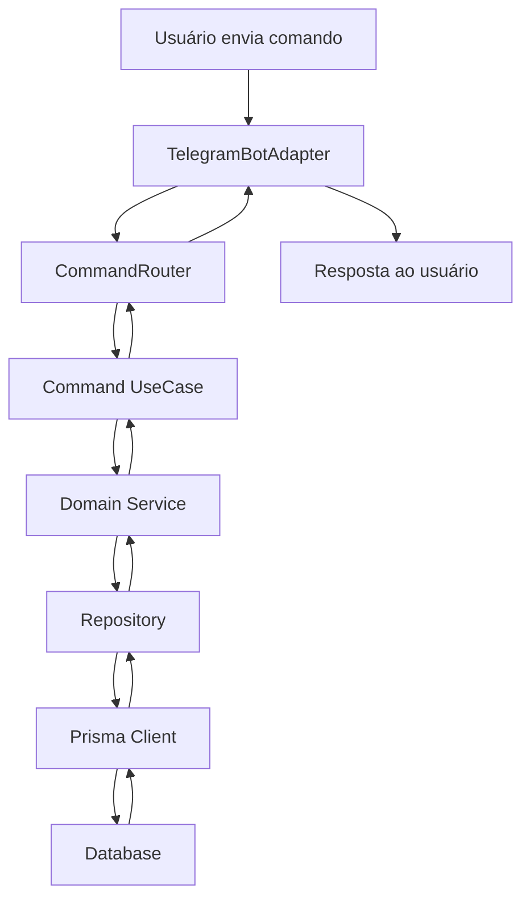
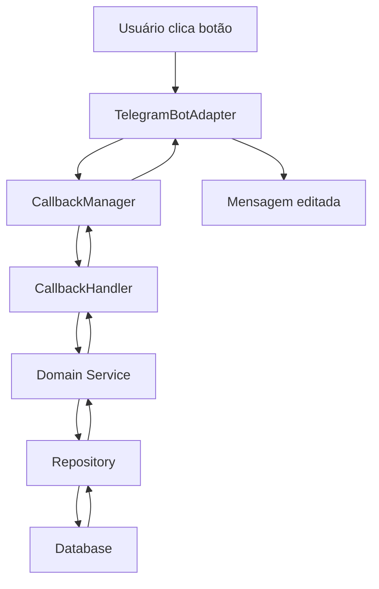

# 🏗️ Arquitetura do Dash Bot

## 📋 Visão Geral

O Dash Bot foi desenvolvido seguindo os princípios da **Clean Architecture** e **SOLID**, garantindo um código organizalo, testável e de fácil manutenção.

## � Como Funciona o Fluxo de Trabalho

Antes de mergulhar na estrutura técnica, é importante entender **como uma mensagem do usuário se transforma em uma resposta do bot**:

1. **📱 Usuário envia comando** → O usuário digita `/corridas` no Telegram
2. **🔄 Adaptador captura** → O `TelegramBotAdapter` recebe e processa a mensagem
3. **🎯 Roteador direciona** → O `CommandRouter` identifica qual comando executar
4. **⚙️ Caso de uso executa** → O comando `listRaces` é executado na camada de aplicação
5. **�🏗️ Serviço de domínio** → O `RaceService` aplica as regras de negócio
6. **💾 Repositório consulta** → O `RaceRepository` busca dados no banco
7. **📤 Resposta enviada** → O resultado volta pelo mesmo caminho até o usuário

Esta arquitetura garante que **cada camada tem uma responsabilidade clara** e **mudanças em uma camada não afetam as outras**.

## 🏗️ Arquitetura em Camadas

### 1. **Camada de Adaptadores (Adapters)**

> **🎯 Propósito**: Esta camada é o **ponto de entrada** do bot. Ela recebe mensagens do Telegram e as converte para um formato que o resto da aplicação entende, mantendo o código independente da plataforma.

```
src/adapters/
├── in/
│   ├── telegram/           # Adapter para Telegram
│   │   └── TelegramBotAdapter.ts
│   └── whatsapp/           # Adapter para WhatsApp (futuro)
│       └── WhatsAppBotAdapter.ts
```

**Responsabilidades:**

- Receber e processar mensagens das plataformas
- Converter dados externos para o formato interno
- Gerenciar conexões com APIs externas
- Implementar a interface `PlatformAdapter`

**Fluxo de Trabalho:**

1. Escuta mensagens do Telegram
2. Extrai informações relevantes (comando, argumentos, usuário)
3. Converte para `CommandInput` (formato interno)
4. Envia para o `CommandRouter`
5. Recebe `CommandOutput` e formata para o Telegram

### 2. **Camada de Aplicação (Application)**

> **🎯 Propósito**: Esta é a **camada de orquestração** onde os casos de uso são implementados. Ela coordena o fluxo de trabalho entre as diferentes partes do sistema, definindo **o que** o bot deve fazer (sem se preocupar com **como** fazer).

```
src/Bot/
├── commands/
│   └── usecases/          # Casos de uso organizados por domínio
│       ├── races/         # Domínio de corridas
│       │   ├── commands/  # Comandos relacionados a corridas
│       │   └── callbacks/ # Callbacks de corridas
│       ├── user/          # Domínio de usuário
│       │   ├── commands/  # Comandos de usuário
│       │   └── callbacks/ # Callbacks de usuário
│       └── shared/        # Componentes compartilhados
├── config/
│   ├── callback/          # Gerenciamento de callbacks
│   └── commands/          # Registro de comandos
└── router/
    └── CommandRouter.ts   # Roteamento de comandos
```

**Responsabilidades:**

- Implementar casos de uso do negócio
- Coordenar fluxos de trabalho
- Gerenciar comandos e callbacks
- Orquestrar interações entre camadas

**Fluxo de Trabalho:**

1. **CommandRouter** recebe entrada do adaptador
2. **CommandRegistry** identifica qual comando executar
3. **UseCase** (ex: `listRaces`) é executado
4. UseCase chama **serviços de domínio** necessários
5. **CallbackManager** gerencia interações com botões
6. Resultado é formatado e retornado ao adaptador

### 3. **Camada de Domínio (Domain)**

> **🎯 Propósito**: Esta é a **camada mais importante** - o coração do negócio. Aqui estão as regras que definem **como corridas funcionam**, **quais são válidas**, **como usuários interagem** com elas. Esta camada **não depende de nenhuma tecnologia externa**.

```
src/core/domain/
├── entities/              # Entidades do negócio
│   ├── Race.ts           # Entidade Corrida
│   └── User.ts           # Entidade Usuário
├── repositories/          # Interfaces dos repositórios
│   ├── RaceRepository.ts
│   └── UserRepository.ts
└── services/             # Serviços de domínio
    ├── RaceService.ts
    └── UserService.ts
```

**Responsabilidades:**

- Definir regras de negócio
- Implementar entidades e value objects
- Especificar interfaces para repositórios
- Conter a lógica principal da aplicação

**Fluxo de Trabalho:**

1. **Entidades** (Race, User) representam conceitos do negócio
2. **Serviços de domínio** aplicam regras complexas
3. **Interfaces de repositório** definem como dados são acessados
4. **Validações** garantem integridade dos dados
5. **Lógica de negócio** é executada de forma independente

### 4. **Camada de Infraestrutura (Infrastructure)**

> **🎯 Propósito**: Esta camada **implementa os detalhes técnicos** definidos pelo domínio. Ela se conecta com banco de dados, APIs externas e outros serviços, mas sempre **seguindo as regras definidas pelas camadas superiores**.

```
src/core/infra/
├── prisma/               # Implementações Prisma
├── prisma/               # Implementações Prisma
│   ├── client.ts         # Cliente Prisma
│   ├── PrismaRaceRepository.ts
│   └── PrismaUserRepository.ts
├── dependencies.ts       # Injeção de dependências
└── scripts/             # Scripts auxiliares
    ├── seedRaces.ts
    └── clearDatabase.ts
```

**Responsabilidades:**

- Implementar interfaces de repositório
- Gerenciar conexões com banco de dados
- Configurar injeção de dependências
- Integrar com serviços externos

**Fluxo de Trabalho:**

1. **Repositórios Prisma** implementam interfaces do domínio
2. **Cliente Prisma** gerencia conexão com banco de dados
3. **Injeção de dependências** conecta camadas
4. **Scripts** mantêm dados de teste e desenvolvimento
5. **Configurações** definem ambiente de execução

## 🔄 Fluxo de Execução Detalhado

### 🚀 Como um Comando é Processado

Quando um usuário envia `/corridas`, aqui está **exatamente** o que acontece:

#### 1. **Recepção da Mensagem**

```typescript
// TelegramBotAdapter.ts - Ponto de entrada
async handleMessage(message: Message): Promise<void> {
  // 🎯 O que acontece aqui:
  // 1. Telegram envia mensagem via webhook
  // 2. Extraímos informações relevantes (usuário, comando, argumentos)
  // 3. Convertemos para formato interno independente de plataforma

  console.log('📨 Mensagem recebida:', message.text);

  // Extrai informações da mensagem do Telegram
  const input = this.parseMessage(message);

  console.log('🔄 Comando processado:', input.command);

  // Repassa para o roteador
  await this.commandRouter.handle(input);
}
```

#### 2. **Roteamento do Comando**

```typescript
// CommandRouter.ts - Identificação do comando
async handle(input: CommandInput): Promise<void> {
  // 🎯 O que acontece aqui:
  // 1. Identifica qual comando foi enviado (/corridas, /config, etc.)
  // 2. Busca o handler (função) correspondente no registro
  // 3. Executa o caso de uso apropriado
  // 4. Retorna resultado formatado para o adapter

  console.log('🎯 Roteando comando:', input.command);

  // Identifica qual comando executar
  const handler = this.registry.getHandler(input.command);

  if (!handler) {
    throw new Error(`Comando não encontrado: ${input.command}`);
  }

  // Executa o caso de uso apropriado
  const output = await handler(input);

  console.log('📤 Enviando resposta:', output.text.substring(0, 100) + '...');

  // Retorna resultado para o adaptador
  await this.adapter.sendMessage(input.chatId, output);
}
```

#### 3. **Execução do Caso de Uso**

```typescript
// listRaces.ts - Lógica da aplicação
export async function listRacesCommand(
  input: CommandInput
): Promise<CommandOutput> {
  // 🎯 O que acontece aqui:
  // 1. Extrai filtros dos argumentos (se houver)
  // 2. Chama serviço de domínio para buscar corridas
  // 3. Formata resultado para apresentação
  // 4. Cria botões interativos para filtros

  console.log("⚙️ Executando caso de uso listRaces");

  // Extrai filtros dos argumentos
  const filters = this.parseFilters(input.args);

  // Chama serviço de domínio
  const races = await raceService.getAvailableRaces(filters);

  console.log("📋 Corridas encontradas:", races.length);

  // Formata resposta com botões interativos
  return formatRaceList(races);
}
```

#### 4. **Aplicação das Regras de Negócio**

```typescript
// RaceService.ts - Domínio
async getAvailableRaces(filters?: RaceFilters): Promise<Race[]> {
  // 🎯 O que acontece aqui:
  // 1. Busca corridas no repositório
  // 2. Aplica regras de negócio específicas
  // 3. Filtra apenas corridas disponíveis
  // 4. Ordena por relevância

  console.log('🏗️ Aplicando regras de negócio');

  // Busca corridas no repositório
  const races = await this.raceRepository.findAll();

  // Aplica regras de negócio (ex: apenas corridas futuras)
  const availableRaces = races.filter(race => {
    // Regra 1: Corrida deve estar no futuro
    if (race.date <= new Date()) return false;

    // Regra 2: Status deve ser 'open'
    if (race.status !== 'open') return false;

    // Regra 3: Deve ter pelo menos 3 dias para inscrição
    const daysUntilRace = (race.date.getTime() - Date.now()) / (1000 * 60 * 60 * 24);
    if (daysUntilRace < 3) return false;

    return true;
  });

  console.log('✅ Corridas disponíveis:', availableRaces.length);

  // Aplica filtros se fornecidos
  if (filters) {
    return this.applyFilters(availableRaces, filters);
  }

  return availableRaces;
}
```

#### 5. **Acesso aos Dados**

```typescript
// PrismaRaceRepository.ts - Infraestrutura
async findAll(): Promise<Race[]> {
  // 🎯 O que acontece aqui:
  // 1. Executa consulta SQL via Prisma
  // 2. Converte dados do banco para entidades de domínio
  // 3. Retorna lista de corridas

  console.log('💾 Consultando banco de dados');

  // Consulta banco de dados
  const prismaRaces = await this.prisma.race.findMany({
    orderBy: {
      date: 'asc'
    }
  });

  console.log('📊 Registros encontrados:', prismaRaces.length);

  // Converte para entidade de domínio
  const races = prismaRaces.map(race => new Race({
    id: race.id,
    title: race.title,
    organization: race.organization,
    date: race.date,
    location: race.location,
    distances: JSON.parse(race.distances),
    distancesNumbers: JSON.parse(race.distancesNumbers),
    status: race.status,
    link: race.link,
    time: race.time,
    createdAt: race.createdAt,
    updatedAt: race.updatedAt
  }));

  return races;
}
```

### 🔄 Como um Callback é Processado

Quando um usuário clica em um botão, o fluxo é similar mas com algumas diferenças:

#### 1. **Recepção do Callback**

```typescript
// TelegramBotAdapter.ts - Callback do botão
async handleCallback(query: CallbackQuery): Promise<void> {
  // 🎯 O que acontece aqui:
  // 1. Usuário clica em botão (ex: "5km")
  // 2. Telegram envia callback_query com dados do botão
  // 3. Extraímos e deserializamos os dados
  // 4. Repassamos para o gerenciador de callbacks

  console.log('🔘 Callback recebido:', query.data);

  // Extrai dados do callback
  const callbackData = this.parseCallback(query);

  console.log('🔄 Processando callback:', callbackData.type);

  // Repassa para o gerenciador
  await this.callbackManager.handle(callbackData);
}
```

#### 2. **Processamento do Callback**

```typescript
// CallbackManager.ts - Gerenciamento de callbacks
async handle(data: CallbackData): Promise<void> {
  // 🎯 O que acontece aqui:
  // 1. Identifica qual tipo de callback foi clicado
  // 2. Encontra o handler apropriado
  // 3. Executa processamento específico
  // 4. Edita mensagem existente com novos dados

  console.log('🎯 Gerenciando callback:', data.type);

  // Identifica qual handler executar
  const handler = this.registry.getHandler(data.type);

  if (!handler) {
    throw new Error(`Handler não encontrado para: ${data.type}`);
  }

  // Executa e edita mensagem existente
  const output = await handler(data);

  console.log('✏️ Editando mensagem com novos dados');

  await this.adapter.editMessage(data.chatId, data.messageId, output);
}
```

### 📊 Benefícios Desta Arquitetura

1. **🔧 Manutenibilidade**: Cada camada tem responsabilidade clara
2. **🧪 Testabilidade**: Camadas podem ser testadas isoladamente
3. **🔄 Flexibilidade**: Fácil adicionar novos comandos ou plataformas
4. **📈 Escalabilidade**: Estrutura suporta crescimento do projeto
5. **🛡️ Robustez**: Mudanças em uma camada não quebram outras

## 🔄 Fluxo de Execução

### Fluxo de Comando



### Fluxo de Callback



## 📝 Princípios Arquiteturais

### 1. **Inversão de Dependências**

```typescript
// ✅ Correto - Domínio não depende de infraestrutura
export class RaceService {
  constructor(private raceRepository: RaceRepository) {}
}

// ❌ Incorreto - Dependência direta
export class RaceService {
  constructor(private prismaClient: PrismaClient) {}
}
```

## 📝 Princípios Arquiteturais Aplicados

### 1. **Inversão de Dependências**

> **🎯 Por que isso importa?** Este princípio garante que **regras de negócio não dependem de tecnologias específicas**. Se decidirmos trocar Prisma por MongoDB, só precisamos alterar a camada de infraestrutura.

```typescript
// ✅ Correto - Domínio não depende de infraestrutura
export class RaceService {
  constructor(private raceRepository: RaceRepository) {}
  // raceRepository é uma interface, não uma implementação específica
}

// ❌ Incorreto - Dependência direta
export class RaceService {
  constructor(private prismaClient: PrismaClient) {}
  // Agora o domínio está acoplado ao Prisma
}
```

### 2. **Separação de Responsabilidades**

> **🎯 Cada classe tem um propósito específico** e bem definido:

```typescript
// Command - Coordena o fluxo
export async function listRacesCommand(
  input: CommandInput
): Promise<CommandOutput> {
  const races = await raceService.getAvailableRaces();
  return formatRaceList(races);
}

// Service - Aplica regras de negócio
export class RaceService {
  async getAvailableRaces(): Promise<Race[]> {
    const races = await this.raceRepository.findAll();
    return races.filter((race) => race.isAvailable());
  }
}

// Repository - Acessa dados
export class PrismaRaceRepository {
  async findAll(): Promise<Race[]> {
    return await this.prisma.race.findMany();
  }
}
```

### 3. **Princípio da Responsabilidade Única**

> **🎯 Cada arquivo/classe tem apenas uma razão para mudar**:

- **CommandRouter**: Só muda se o roteamento mudar
- **RaceService**: Só muda se regras de corrida mudarem
- **PrismaRaceRepository**: Só muda se estrutura do banco mudar
- **TelegramBotAdapter**: Só muda se API do Telegram mudar

### 4. **Dependency Injection**

> **🎯 Como as camadas se conectam** sem criar dependências diretas:

```typescript
// dependencies.ts - Configuração centralizada
export function createDependencies() {
  const prismaClient = new PrismaClient();
  const raceRepository = new PrismaRaceRepository(prismaClient);
  const raceService = new RaceService(raceRepository);

  return {
    raceService,
    userService,
    // ... outros serviços
  };
}
```

## 🚀 Adicionando Novas Funcionalidades

### Como Adicionar um Novo Comando

> **🎯 Fluxo de trabalho**: Quando você quer adicionar `/clima` para consultar tempo:

#### 1. **Defina a Entidade de Domínio**

```typescript
// src/core/domain/entities/Weather.ts
export class Weather {
  constructor(
    public temperature: number,
    public condition: string,
    public city: string
  ) {}

  isGoodForRunning(): boolean {
    return this.temperature > 10 && this.temperature < 30;
  }
}
```

#### 2. **Crie o Serviço de Domínio**

```typescript
// src/core/domain/services/WeatherService.ts
export class WeatherService {
  async getWeatherForCity(city: string): Promise<Weather> {
    // Regras de negócio específicas
  }
}
```

#### 3. **Implemente o Caso de Uso**

```typescript
// src/Bot/commands/usecases/weather/commands/checkWeather.ts
export async function checkWeatherCommand(
  input: CommandInput
): Promise<CommandOutput> {
  const city = input.args?.[0] || "São Paulo";
  const weather = await weatherService.getWeatherForCity(city);

  return {
    text: `🌤️ Tempo em ${city}: ${weather.temperature}°C\n${weather.condition}`,
    format: "HTML",
  };
}
```

#### 4. **Registre o Comando**

```typescript
// src/Bot/commands/usecases/weather/commands/index.ts
export const weatherCommands = {
  clima: checkWeatherCommand,
  weather: checkWeatherCommand,
};
```

### Como Adicionar um Novo Callback

> **🎯 Para adicionar interação com botões**:

#### 1. **Defina o Tipo de Callback**

```typescript
// src/types/callbacks/weatherCallbacks.ts
export interface WeatherCallbackData extends CallbackData {
  type: "weather_detail";
  city: string;
}
```

#### 2. **Implemente o Handler**

```typescript
// src/Bot/commands/usecases/weather/callbacks/weatherDetail.ts
export async function weatherDetailCallback(
  data: WeatherCallbackData
): Promise<CommandOutput> {
  const weather = await weatherService.getDetailedWeather(data.city);
  return formatDetailedWeather(weather);
}
```

#### 3. **Registre o Callback**

```typescript
// src/Bot/commands/usecases/weather/callbacks/index.ts
export const weatherCallbacks = {
  weather_detail: weatherDetailCallback,
};
```

## 🔍 Debugging e Troubleshooting

### Rastreando o Fluxo

> **🎯 Como debugar** quando algo não funciona:

1. **Verifique o Adapter**: Mensagem está chegando?
2. **Verifique o Router**: Comando está sendo reconhecido?
3. **Verifique o UseCase**: Lógica está sendo executada?
4. **Verifique o Service**: Regras de negócio estão corretas?
5. **Verifique o Repository**: Dados estão sendo buscados?

### Logs Estruturados

```typescript
// Em cada camada, adicione logs para rastrear o fluxo
export async function listRacesCommand(
  input: CommandInput
): Promise<CommandOutput> {
  console.log("📍 Executando listRacesCommand", { userId: input.userId });

  const races = await raceService.getAvailableRaces();
  console.log("📍 Corridas encontradas", { count: races.length });

  return formatRaceList(races);
}
```

Esta arquitetura garante que o código seja **limpo, testável e fácil de manter**, seguindo as melhores práticas de desenvolvimento de software.

## 📚 Próximos Passos

Para aprender mais sobre como implementar funcionalidades específicas:

- **📖 [API Reference](API.md)** - Interfaces e tipos disponíveis
- **🎯 [Tutorial](TUTORIAL.md)** - Exemplos práticos passo a passo
- **📝 [Documentation](DOCUMENTATION.md)** - Guia completo de desenvolvimento
- **🚀 [Deployment](DEPLOYMENT.md)** - Como colocar em produção
  return formatRacesResponse(races);
  }

// Service - Regras de negócio
export class RaceService {
async getAvailableRaces(): Promise<Race[]> {
const races = await this.raceRepository.findAll();
return races.filter((race) => race.status === RaceStatus.OPEN);
}
}

````

### 3. **Dependency Injection**

```typescript
// dependencies.ts
export const raceRepository = new PrismaRaceRepository();
export const raceService = new RaceService(raceRepository);
````

## 🎯 Padrões de Design

### 1. **Strategy Pattern - Platform Adapters**

```typescript
interface PlatformAdapter {
  sendMessage(chatId: string, output: CommandOutput): Promise<void>;
  editMessage(
    chatId: string,
    messageId: string,
    output: CommandOutput
  ): Promise<void>;
}

class TelegramPlatformAdapter implements PlatformAdapter {
  // Implementação específica do Telegram
}

class WhatsAppPlatformAdapter implements PlatformAdapter {
  // Implementação específica do WhatsApp
}
```

### 2. **Command Pattern - Commands**

```typescript
interface CommandHandler {
  (input: CommandInput): Promise<CommandOutput>;
}

const commands: Record<string, CommandHandler> = {
  "/corridas": listRacesCommand,
  "/proxima_corrida": nextRaceCommand,
  "/config": configCommand,
};
```

### 3. **Chain of Responsibility - Callbacks**

```typescript
abstract class CallbackHandler {
  abstract canHandle(callbackData: CallbackData): boolean;
  abstract handle(input: CommandInput): Promise<CommandOutput>;
}

class CallbackManager {
  private handlers: CallbackHandler[] = [];

  async handleCallback(input: CommandInput): Promise<CommandOutput> {
    for (const handler of this.handlers) {
      if (handler.canHandle(input.callbackData)) {
        return await handler.handle(input);
      }
    }
    throw new Error("No handler found");
  }
}
```

## 🧪 Testabilidade

### 1. **Testes Unitários**

```typescript
describe("RaceService", () => {
  let raceService: RaceService;
  let mockRepository: jest.Mocked<RaceRepository>;

  beforeEach(() => {
    mockRepository = {
      findAll: jest.fn(),
      findById: jest.fn(),
      create: jest.fn(),
      update: jest.fn(),
      delete: jest.fn(),
    };
    raceService = new RaceService(mockRepository);
  });

  test("should return only open races", async () => {
    mockRepository.findAll.mockResolvedValue([
      { id: "1", status: RaceStatus.OPEN },
      { id: "2", status: RaceStatus.CLOSED },
    ]);

    const races = await raceService.getAvailableRaces();
    expect(races).toHaveLength(1);
    expect(races[0].status).toBe(RaceStatus.OPEN);
  });
});
```

### 2. **Testes de Integração**

```typescript
describe("ListRacesCommand", () => {
  test("should return formatted races list", async () => {
    const input: CommandInput = {
      chatId: "123",
      userId: "user1",
      command: "/corridas",
    };

    const output = await listRacesCommand(input);

    expect(output.text).toContain("Corridas Disponíveis");
    expect(output.format).toBe("HTML");
    expect(output.keyboard).toBeDefined();
  });
});
```

## 🔧 Configuração e Extensibilidade

### 1. **Adicionando Novos Comandos**

```typescript
// 1. Criar o comando
export async function myNewCommand(
  input: CommandInput
): Promise<CommandOutput> {
  // Lógica do comando
}

// 2. Registrar no router
const commands: Record<string, CommandHandler> = {
  "/my_command": myNewCommand,
};
```

### 2. **Adicionando Novos Callbacks**

```typescript
// 1. Definir o tipo
interface MyCallbackData extends BaseCallbackData {
  type: "my_callback";
  parameter: string;
}

// 2. Criar o handler
class MyCallbackHandler extends CallbackHandler {
  canHandle(data: CallbackData): boolean {
    return data.type === "my_callback";
  }

  async handle(input: CommandInput): Promise<CommandOutput> {
    // Lógica do callback
  }
}

// 3. Registrar o handler
callbackManager.registerHandler(new MyCallbackHandler());
```

### 3. **Adicionando Novos Adapters**

```typescript
class NewPlatformAdapter implements PlatformAdapter {
  async sendMessage(chatId: string, output: CommandOutput): Promise<void> {
    // Implementação específica da plataforma
  }

  async editMessage(
    chatId: string,
    messageId: string,
    output: CommandOutput
  ): Promise<void> {
    // Implementação específica da plataforma
  }
}
```

## 📊 Métricas de Qualidade

### 1. **Cobertura de Testes**

- **Meta**: 80%+ de cobertura
- **Comando**: `npm run test:coverage`

### 2. **Complexidade Ciclomática**

- **Meta**: < 10 por função
- **Ferramenta**: ESLint com regras de complexidade

### 3. **Dependências**

- **Acoplamento**: Baixo entre camadas
- **Coesão**: Alta dentro das camadas

## 🚀 Benefícios da Arquitetura

### ✅ **Vantagens**

- **Testabilidade**: Cada camada pode ser testada isoladamente
- **Manutenibilidade**: Código organizado e fácil de modificar
- **Escalabilidade**: Fácil adicionar novas funcionalidades
- **Flexibilidade**: Suporte a múltiplas plataformas
- **Reutilização**: Componentes podem ser reutilizados

### 📈 **Evolução**

- **Modularidade**: Organização por domínios de negócio
- **Extensibilidade**: Plugins e adapters personalizados
- **Performance**: Otimizações específicas por camada
- **Monitoramento**: Logs e métricas estruturados

## 📚 Referências

- [Clean Architecture - Robert C. Martin](https://blog.cleancoder.com/uncle-bob/2012/08/13/the-clean-architecture.html)
- [SOLID Principles](https://en.wikipedia.org/wiki/SOLID)
- [Dependency Injection](https://en.wikipedia.org/wiki/Dependency_injection)
- [Domain-Driven Design](https://en.wikipedia.org/wiki/Domain-driven_design)

---

Esta arquitetura garante que o Dash Bot seja robusto, testável e pronto para evoluir com novas funcionalidades e plataformas.
